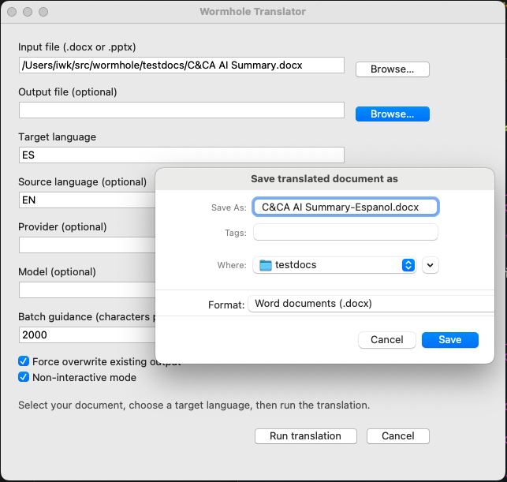

# Wormhole Document Translator

[](LICENSE)

[](https://docs.astral.sh/uv/)

[](FOSS_PLURALISM_MANIFESTO.md)
[](https://github.com/soyrochus/wormhole/issues)


Wormhole is a command-line translator that rewrites Word (`.docx`) and PowerPoint (`.pptx`) files into another language while keeping the original layout intact. The tool walks every paragraph, table cell, header, footer, text box, and note, collects their text with deterministic identifiers, batches the content for an LLM, reinserts the translated text in place, and finally saves the result as a new document plus a friendly completion report.

The CLI is designed for teams that want a provider-agnostic workflow: switching to a different LLM requires only a new adapter, not a new command-line contract.

## Key Features

- Full support for `.docx` and `.pptx` sources (body, tables, headers/footers, notes).
- Deterministic IDs for every text unit to guarantee stable reinsertion.
- Layout-preserving reinsertion, even across runs with custom formatting.
- Batch planner that respects sentence boundaries with a default 2,000 character budget.
- Automatic retries, resumable error policy, and friendly messaging for interactive and non-interactive environments.
- Provider abstraction with an OpenAI implementation out of the box and support for `.env` configuration via `python-dotenv`.

## Requirements

- Python 3.13 (managed through [uv](https://github.com/astral-sh/uv)).
- An OpenAI API key (`OPENAI_API_KEY`) when using the default provider.
- Optional `.env` file in the project root for environment configuration (`OPENAI_API_KEY`, `WORMHOLE_PROVIDER_DEBUG`, etc.).

## Installation (uv only)

1. **Install uv**  
   Follow the official uv installation guide: <https://docs.astral.sh/uv/>.

2. **Clone the repository**

   ```bash
   git clone https://github.com/your-org/wormhole.git
   cd wormhole
   ```

3. **Sync dependencies with uv**
   
   ```bash
   uv sync
   ```
   
   `uv` reads `pyproject.toml` and `uv.lock`, creating an isolated environment pinned to the recorded dependency versions.

4. **Configure credentials**  
   Create a `.env` file or export environment variables so the CLI can load your credentials:
   
   ```bash
   echo "OPENAI_API_KEY=sk-your-key" >> .env
   # Optional additional flags:
   # echo "WORMHOLE_PROVIDER_DEBUG=1" >> .env
   ```
   
   `wormhole.cli` calls `load_dotenv()` on startup, so entries in `.env` automatically populate the environment.

## Usage Overview

Run the CLI through uv so dependencies resolve inside the managed environment:

```bash
# Show help
uv run python -m wormhole.cli --help

# Translate a document
uv run python -m wormhole.cli \
  devloop.pptx \
  --target-language en \
  --source-language es \
  --output devloop_en.pptx \
  --verbose
```

Alternatively, the project exposes a convenience entry point via `main.py`:

```bash
uv run main.py devloop.pptx --target-language en
```

During execution Wormhole prints progress (and, optionally, provider debug output) and writes a summary that includes translated units, skipped elements, batch counts, and elapsed time. The original document remains untouched; the translated file is written to the path you specified or, by default, a sibling file suffixed with the sanitized target language.

Prefer a visual workflow? Launch the Tkinter GUI with `./wormhole.sh --gui` on MacOS and Linux or `./wormhole.ps1 --gui` on Windows; the window maps all core CLI options and still streams debug/verbose logs to the terminal.



### Launcher scripts (Bash and PowerShell)

If you prefer a one-command launcher that manages the uv environment for you, use the included wrappers:

macOS/Linux (Bash/zsh):

```bash
./wormhole.sh --help
./wormhole.sh input.docx -t ES -s EN -o output_es.docx -v
```

Windows or PowerShell Core:

```powershell
./wormhole.ps1 --help
./wormhole.ps1 input.pptx -t EN -s ES -o output_en.pptx -v
```

Both launchers:

- Run `uv sync` automatically (set `UV_SYNC=0` to skip)
- Forward all CLI arguments to the module (`wormhole.cli`)
- Accept extra uv options via `UV_ARGS` (for example to pin Python):

```bash
UV_ARGS="--python 3.11" ./wormhole.sh --version
```

## Command-Line Reference

| Option | Description | Notes |
| ------ | ----------- | ----- |
| `input_file` | Path to the `.docx` or `.pptx` file to translate. | Required positional argument. |
| `-t, --target-language` | Destination language (ISO-639 code or full name). | Required. |
| `-s, --source-language` | Optional source language hint. | Helps segmentation and provider prompts. |
| `-o, --output` | Output file path. | Defaults to appending the target language to the input stem; the input file is never overwritten. |
| `-p, --provider` | Translation provider identifier. | Defaults to `openai`. |
| `-m, --model` | Provider-specific model or engine name. | Overrides provider default (`gpt-4o-mini` for OpenAI). |
| `-b, --batch-guidance` | Approximate max characters per translation batch. | Integer, default `2000`; sentences are kept intact where possible. |
| `-f, --force` | Allow overwriting an existing output file. | Without this flag, the CLI aborts if the output path exists. |
| `--non-interactive` | Disable prompts and automatic pauses. | Suitable for CI; still respects error thresholds. |
| `-v, --verbose` | Print detailed progress information. | Helpful for tracking segmentation and batches. |
| `--debug-provider` | Log full provider request/response payloads to stderr. | Equivalent env vars: `WORMHOLE_PROVIDER_DEBUG=1` or `WORMHOLE_DEBUG_PROVIDER=1`. |
| `--gui` | Launch the Tkinter-based configuration window. | Ideal for interactive runs; CLI-only flags such as `--verbose` still print to the console. |

### Error Handling Notes

- The input document is opened read-only and never overwritten.
- If the output file exists and `--force` is not supplied, Wormhole exits with a friendly message.
- Recoverable errors are retried automatically (up to three times per batch). After repeated failures, you can choose to continue, retry, or abort; in non-interactive mode the CLI continues until policy limits are exceeded.
- Irrecoverable errors (missing files, unsupported types, configuration issues) produce human-readable guidance and exit with a non-zero code.

## Working with Providers

The default OpenAI provider reads `OPENAI_API_KEY` from the environment. The adapter can be extended to support alternate providers while keeping the existing CLI contract intact. Provider debugging can be enabled via the `--debug-provider` flag or either `WORMHOLE_PROVIDER_DEBUG=1` or `WORMHOLE_DEBUG_PROVIDER=1` in the environment.

### OpenAI Responses vs Legacy Completions

Wormhole ships with a single OpenAI adapter that understands two transport modes:

- **OpenAI / Azure OpenAI (Responses API)** — the default path, using OpenAI's Responses endpoint (and the Azure equivalent) for JSON-native output.
- **Legacy OpenAI (Completions API)** — an opt-in fallback for deployments that have not enabled the Responses API yet.

Select the correct backend through environment variables:

- `LLM_PROVIDER=openai` (default) uses `OPENAI_API_KEY`.
- `LLM_PROVIDER=azure_openai` switches the same adapter to Azure OpenAI; provide:
  - `AZURE_OPENAI_API_KEY`
  - `AZURE_OPENAI_ENDPOINT`
  - `AZURE_OPENAI_API_VERSION`
  - `AZURE_OPENAI_DEPLOYMENT_NAME`
  - `AZURE_OPENAI_EMBEDDING_MODEL`

Usage examples:

```bash
# Responses API with OpenAI (default provider)
uv run python -m wormhole.cli input.docx -t es

# Responses API with Azure OpenAI
LLM_PROVIDER=azure_openai \
AZURE_OPENAI_API_KEY=... \
AZURE_OPENAI_ENDPOINT=https://your-endpoint.openai.azure.com \
AZURE_OPENAI_API_VERSION=2024-12-01-preview \
AZURE_OPENAI_DEPLOYMENT_NAME=gpt-4o \
uv run python -m wormhole.cli input.docx -t es

# Chat Completions via the legacy adapter
uv run python -m wormhole.cli input.docx -t es --provider legacy-openai
```

Choose the legacy adapter only when your account cannot access the Responses API; it emits the same JSON contract but leverages the Chat Completions endpoint behind the scenes.

## 🐧 Development Environment

This project uses [Pengu](https://github.com/soyrochus/pengu) — a tool that gives you a persistent Linux environment in a container, instantly available from any operating system.

**Get started:**
```bash
# Install Pengu (Linux/macOS)
curl -fsSL https://raw.githubusercontent.com/soyrochus/pengu/main/pengu-install.sh | bash -s -- -y

# Start your Linux environment
./pengu up && ./pengu shell
```

**Windows:**
```powershell
iwr -useb https://raw.githubusercontent.com/soyrochus/pengu/main/pengu-install.ps1 | iex
.\pengu.ps1 up; .\pengu.ps1 shell
```

Your project files are available at `/workspace` with all dependencies pre-configured. No local setup required.

## Principles of Participation

Everyone is invited and welcome to contribute: open issues, propose pull requests, share ideas, or help improve documentation.  
Participation is open to all, regardless of background or viewpoint.  

This project follows the [FOSS Pluralism Manifesto](./FOSS_PLURALISM_MANIFESTO.md),  
which affirms respect for people, freedom to critique ideas, and space for diverse perspectives.  


## License and Copyright

Copyright (c) 2025, Iwan van der Kleijn

This project is licensed under the MIT License. See the [LICENSE](LICENSE) file for details.
