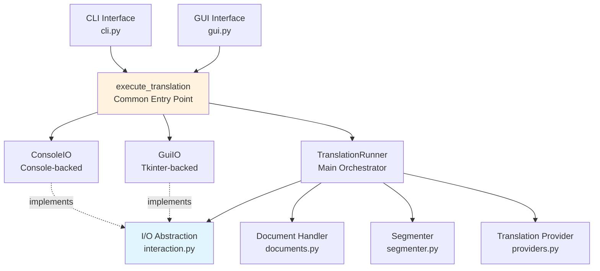
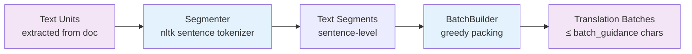
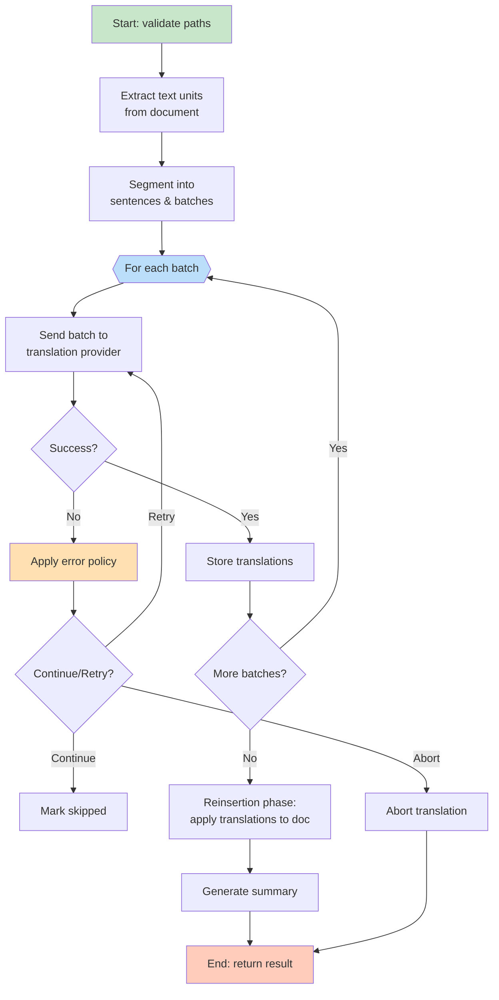
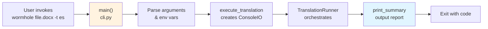
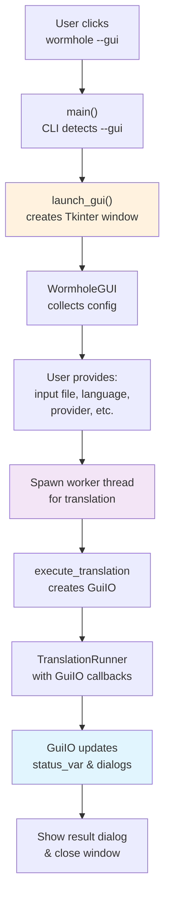
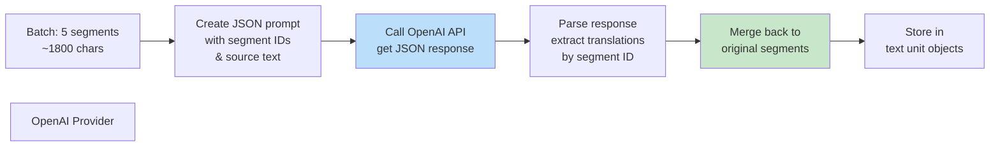

# Wormhole Technical Specification

## Overview

Wormhole is a document translator that preserves layout and structure while translating content in Word (.docx) and PowerPoint (.pptx) files. It supports both CLI and GUI interfaces, using pluggable translation providers (OpenAI, Azure OpenAI) with batch processing for efficiency.

## Architecture



## Core Components

### 1. Document Layer (`documents.py`)
- **Supported Formats**: .docx (Word), .pptx (PowerPoint)
- **Handler Detection**: Auto-detects format and selects appropriate handler
- **Operations**:
  - Extract text units while preserving structure (tables, headers, footers, text boxes)
  - Assign stable IDs to each text unit
  - Store setter functions for reinsertion
  - Reinserert translated text back into documents

### 2. Segmentation Layer (`segmenter.py`)


**Segmentation Process**:
1. Split each text unit into sentences using NLTK tokenizer
2. Create `TextSegment` objects with stable ordering
3. Pack segments into batches respecting character budget
4. Keeps sentences intact (no splitting mid-sentence)

### 3. Translation Provider (`providers.py`)
**Pluggable Architecture**:
- Base `TranslationProvider` protocol
- **OpenAI Implementation**: Supports both:
  - Standard OpenAI API (Responses mode)
  - Azure OpenAI (via `LLM_PROVIDER=azure_openai`)
- **Provider Selection**: Via `LLM_PROVIDER` env var or `--provider` flag
- **Model Selection**: Via `--model` flag or provider defaults

**Translation Process**:
- Sends batch of segments as single prompt
- Requests JSON response with translated segments
- Maintains segment order and IDs
- Handles provider-specific error recovery

### 4. I/O Abstraction (`interaction.py`)
```python
class TranslationIO(Protocol):
    def info(message: str) -> None      # Status/progress output
    def error(message: str) -> None     # Error messages
    def prompt_choice(                  # User interaction
        prompt: str, 
        choices: Sequence[str]
    ) -> str
```

**Implementations**:
- **ConsoleIO** (CLI): Uses `print()` and `input()`
- **GuiIO** (GUI): Updates Tkinter widgets via thread-safe callbacks

This decouples core logic from presentation.

### 5. Translation Runner (`translator.py`)
The orchestrator that coordinates the entire workflow:



## Translation Modes

### CLI Mode



**Key Features**:
- Prompts user for confirmation on errors (unless `--non-interactive`)
- Prints detailed progress if `--verbose`
- Offers Continue/Retry/Abort choices
- Outputs summary to stdout

### GUI Mode



**Key Features**:
- Non-blocking UI with worker thread
- Live status updates in window
- Modal dialogs for user choices (Continue/Retry/Abort)
- Final success/error message box
- Graceful handling of window close during translation

## Error Handling & Policy

**Error Categories** (`errors.py`):
- `ARGUMENT`: Invalid input arguments
- `FILE_IO`: File read/write issues
- `FORMAT`: Unsupported document format
- `TRANSLATION`: Provider errors
- `REINSERTION`: Failure to reinserert translated text
- `NETWORK`: Provider connectivity issues
- `OTHER`: Miscellaneous errors

**Error Policy** (`policy.py`):
Each category has a configurable threshold. When exceeded:
- Automatic abort in non-interactive mode
- User prompt (Continue/Retry/Abort) in interactive mode

**Special Exceptions**:
- `AbortRequested`: User chose to abort
- `NonInteractiveAbort`: Policy threshold exceeded in non-interactive mode
- `OverwriteRefusedError`: Output file exists without `--force`

## Data Flow: Translation of a Single Batch



## File Structure

```
wormhole/
├── __main__.py          # Entry point
├── cli.py               # CLI interface & execute_translation()
├── gui.py               # Tkinter GUI & launch_gui()
├── translator.py        # TranslationRunner orchestrator
├── documents.py         # Document handlers (.docx, .pptx)
├── segmenter.py         # Text segmentation & batching
├── providers.py         # Translation provider implementations
├── interaction.py       # I/O abstraction (TranslationIO protocol)
├── errors.py            # Error definitions & ErrorTracker
├── policy.py            # Error policy thresholds
├── structures.py        # Data classes (TextUnit, Batch, etc.)
└── __pycache__/
```

## Configuration

**Environment Variables**:
```bash
# Translation provider
LLM_PROVIDER=openai              # or azure_openai
OPENAI_API_KEY=sk-...            # Required for openai

# Azure OpenAI (if LLM_PROVIDER=azure_openai)
AZURE_OPENAI_API_KEY=...
AZURE_OPENAI_ENDPOINT=...
AZURE_OPENAI_API_VERSION=...
AZURE_OPENAI_DEPLOYMENT_NAME=...
AZURE_OPENAI_EMBEDDING_MODEL=...

# Debug
WORMHOLE_PROVIDER_DEBUG=1        # Log provider requests/responses
WORMHOLE_DEBUG_PROVIDER=1        # Alias
```

**CLI Arguments**:
```bash
wormhole input.docx -t spanish [options]

Options:
  -t, --target-language      Required. Destination language
  -s, --source-language      Optional source language hint
  -o, --output               Output path (default: input_lang.docx)
  -p, --provider             Provider identifier (default: openai)
  -m, --model                Model/engine name
  -b, --batch-guidance       Max chars per batch (default: 2000)
  -f, --force                Overwrite output without prompting
  --non-interactive          Disable prompts (for CI)
  -v, --verbose              Detailed progress info
  --debug-provider           Log provider debug info
  --gui                      Launch graphical interface
```

## Summary Data Structure

After translation completes, a `TranslationSummary` is returned:

```python
@dataclass
class TranslationSummary:
    input_path: pathlib.Path
    output_path: pathlib.Path
    document_type: str              # "docx" or "pptx"
    source_language: str | None
    target_language: str
    provider_name: str
    model: str | None
    total_units: int                # Total text units in doc
    translated_units: int           # Successfully translated
    skipped_units: int              # Skipped due to errors
    total_segments: int             # Total sentence segments
    total_batches: int              # Number of API batches
    elapsed_seconds: float
    total_errors: int
    error_messages: list[str]       # Human-readable error summaries
```

## Exit Codes

- `0`: Success
- `1`: Permanent failure (invalid args, unsupported format, provider config, etc.)
- `2`: User abort or non-interactive policy abort

## Key Design Decisions

1. **Decoupled I/O**: TranslationIO protocol allows CLI and GUI to coexist without cross-dependencies
2. **Batch Processing**: Sends segments in batches to minimize API calls while staying within token limits
3. **Stable IDs**: Each segment has immutable ID, allowing safe reordering and recovery from partial failures
4. **Worker Thread**: GUI spawns translation in background thread to prevent UI freezing
5. **Error Recovery**: Configurable error policies allow per-category decision thresholds
6. **Non-Breaking Layout**: Document structure (tables, headers, images) preserved during translation
